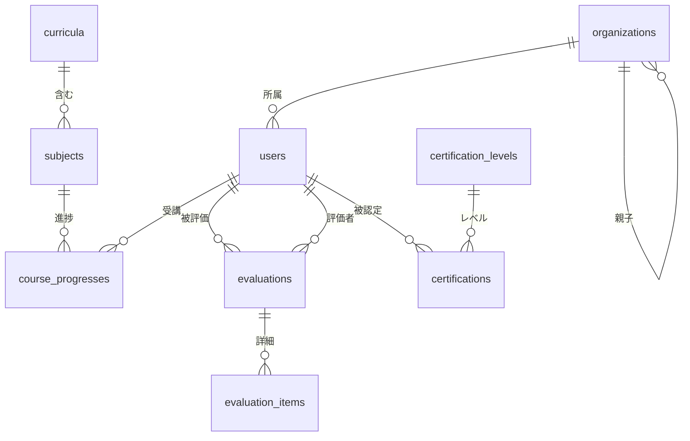

# LISENS MVP 設計サマリー（Step1 & Step2）

> [!IMPORTANT]
> Step1（前提整理）とStep2（設計ドキュメント）の成果物サマリーです。
> Step3（技術提案）に進む前に、この設計内容を確認してください。

---

## 成果物一覧

| ファイル | 内容 | パス |
|----------|------|------|
| [requirements.md](file:///c:/Users/emuri/OneDrive/Desktop/lisens/requirements.md) | 要件定義書（前提条件・要確認事項・仮定・用語定義） | `lisens/requirements.md` |
| [product_spec.md](file:///c:/Users/emuri/OneDrive/Desktop/lisens/product_spec.md) | プロダクト仕様書（全体構想・要件・権限・フロー・ロードマップ） | `lisens/product_spec.md` |
| [db_schema.md](file:///c:/Users/emuri/OneDrive/Desktop/lisens/db_schema.md) | データベース設計書（テーブル定義・ER図・ダミーデータ構成） | `lisens/db_schema.md` |
| [screen_flow.md](file:///c:/Users/emuri/OneDrive/Desktop/lisens/screen_flow.md) | 画面遷移設計書（画面一覧・遷移・UI構成） | `lisens/screen_flow.md` |

---

## Step1: 前提整理の要点

### プロダクトの位置づけ
**LISENS** — 社内ライセンス制度運用アプリ。「教育 × 品質保証 × 人事評価補助」を統合するB2B SaaS。

### MVPスコープ（3機能 + 基盤）
1. **受講進捗管理** — 誰がどこまで学んだかの可視化
2. **実技評価の記録** — 評価の属人化を防ぎ、記録を蓄積
3. **レベル認定の一覧化** — 承認フロー付きの公式認定プロセス
4. **ログイン・認証 + 権限分岐** — B2B SaaSの基盤

### 主要な仮定（要確認事項）

| 仮定 | リスク |
|------|--------|
| カリキュラムは2階層構造 | 3階層以上でDB変更必要 |
| 評価項目は全社共通（固定5項目） | 企業ごとカスタマイズは将来 |
| レベルは5段階（見習い〜マスター） | 段階数変更は将来 |
| シングルテナント | マルチテナントは将来 |
| メール＋パスワード認証 | SSO/SAMLは将来 |

---

## Step2: 設計の要点

### ユーザー権限（5ロール）

```
admin > education_manager > evaluator > store_manager > learner
 全権限    教育管理+承認     評価入力    自店舗閲覧    自分のみ
```

### DB設計（9テーブル + 将来拡張4テーブル）



### 主要画面（9画面）

| 画面 | 導線上の役割 |
|------|-------------|
| ログイン | 入口 |
| ホーム | ロール別エントリー |
| 受講者一覧 | **一覧** |
| 受講者詳細（個人カルテ） | **詳細**（中核画面） |
| 実技評価入力 | **入力** |
| 評価詳細 | 閲覧 |
| 認定一覧 | **一覧** |
| 認定申請 | **入力** |
| 認定詳細・承認 | **承認** |

### 評価フロー
```
評価者 → 受講者選択 → 評価入力（5項目×スコア+コメント）→ 保存 → 履歴に表示
```

### 認定フロー
```
申請者 → 認定申請 → (pending) → 承認者確認 → 承認 or 差し戻し
                                                ↓ 承認時
                                             受講者のレベル更新
```

---

## 将来拡張ロードマップ

````carousel
### Phase 1（MVP）— 今回
- ✅ ログイン・認証
- ✅ 受講進捗管理
- ✅ 実技評価の記録
- ✅ レベル認定の一覧化
- ✅ 基本的な権限分岐
<!-- slide -->
### Phase 2 — 教育機能の強化
- 宿題提出・添削
- 再受講管理
- 上長レビュー（多段階承認）
- テンプレート評価表
- CSV一括インポート/エクスポート
<!-- slide -->
### Phase 3 — 品質保証・人事連携
- 店舗別教育KPI
- 人事評価連携（外部API）
- 品質レビュー履歴
- 面談記録
- 高度な検索・フィルター
<!-- slide -->
### Phase 4 — スケーラビリティ
- 通知機能（メール・Slack）
- 合否判定ロジック
- マルチテナント
- SSO/SAML認証
- 監査ログ
- モバイルアプリ
````

---

## 次のステップ

> [!TIP]
> Step3に進む準備ができています。以下の3つの技術スタックを比較し、MVP最適構成を提案します。

| 候補 | 特徴 |
|------|------|
| Next.js + Supabase | PostgreSQL + RLS + リアルタイム |
| Next.js + Firebase | NoSQL + 高速プロトタイプ |
| React + Node.js + PostgreSQL | フルコントロール |

**Step3に進んでよろしいですか？** 設計に対するフィードバックがあれば、先に反映します。
